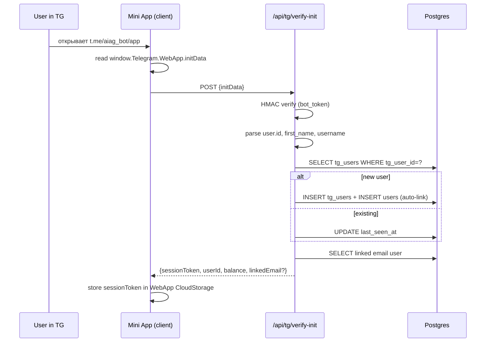
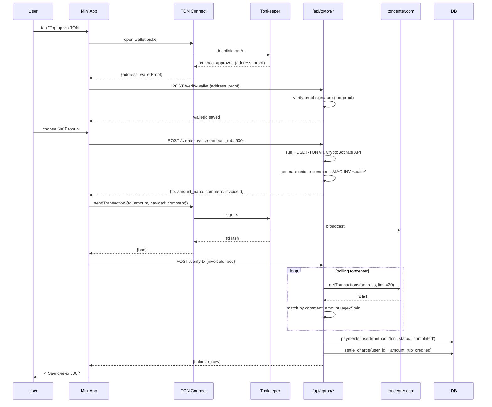
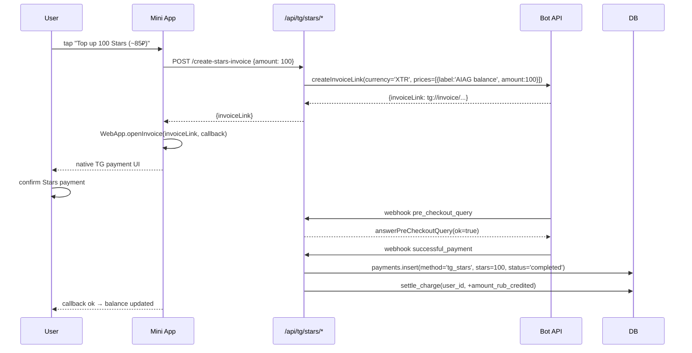

# Phase 15 — Telegram Mini App for AIAG (Design Spec)

**Status:** DESIGN ONLY (no code)
**Date:** 2026-05-08
**Owner:** AIAG core
**Brain ref:** `Projects/AIAG/Knowledge/17-telegram-mini-app.md`
**Wireframes:** `Projects/AIAG/Wireframes/p15-tg-miniapp/*.html`

---

## 1. Goal & Scope

Запустить Telegram Mini App + companion-бота `@aiag_bot` как третью продуктовую surface (web → web-app → TG) для AIAG. Mini App встраивается в Telegram client и даёт:

1. **AIAG Manager Bot** — agentic chat: пользователь пишет «нарисуй кота / сделай видео заката Kling 6s» — бот парсит intent, выбирает модель, гоняет через AIAG Gateway, возвращает результат inline.
2. **B2C Chat / Marketplace mini-UI** — упрощённая версия web-marketplace внутри TG.
3. **Crypto-first payments**: TON Connect (Tonkeeper / MyTonWallet / OpenMask) + Telegram Stars (mini topup).
4. **Notifications**: balance low, new model, contest.
5. **Settings**: linked wallets, web deep-link.

### Out of scope (Phase 15)

- Bot-to-Bot orchestration (Phase 4 в roadmap из brain/17).
- Sub-agent creation wizard (откладывается на Phase 16+).
- Inline-mode `@aiag_bot` в чужих чатах.

---

## 2. Architecture

### 2.1 Component diagram

```mermaid
flowchart TB
    subgraph TG[Telegram Client]
        WV[WebView with Mini App]
        BOT[@aiag_bot DM]
    end

    subgraph Edge[ai-aggregator.ru Edge]
        NGINX[nginx<br/>app.ai-aggregator.ru/tg]
    end

    subgraph App[apps/tg-miniapp]
        NEXT[Next.js 15 App Router<br/>+ @twa-dev/sdk<br/>+ @tonconnect/ui-react]
    end

    subgraph BFF[apps/tg-miniapp/api]
        VERIFY[/api/tg/verify-init<br/>HMAC-SHA256 verify/]
        TON[/api/tg/ton/verify-tx<br/>toncenter polling/]
        STARS[/api/tg/stars/invoice<br/>createInvoiceLink/]
        WEBHOOK[/api/tg/webhook<br/>Bot updates/]
    end

    subgraph Core[Existing AIAG Core]
        GW[Gateway api.ai-aggregator.ru]
        DB[(Postgres)]
        Q[BullMQ jobs]
    end

    WV --> NEXT
    BOT --> WEBHOOK
    NEXT --> VERIFY
    NEXT --> TON
    NEXT --> STARS
    VERIFY --> DB
    TON --> DB
    TON -.toncenter.-> ChainTON((TON network))
    STARS -.Bot API.-> TGAPI((api.telegram.org))
    WEBHOOK --> Q
    Q --> GW
    GW --> DB
    GW --> NEXT
```

### 2.2 Routing & deploy

| URL | Handler |
|-----|---------|
| `t.me/aiag_bot` | DM bot — entrypoint, `/start` opens Mini App via `setMenuButton` |
| `t.me/aiag_bot/app` | Mini App launcher → `https://app.ai-aggregator.ru/tg` |
| `https://app.ai-aggregator.ru/tg` | Next.js SSR root, all client-side after init |
| `https://app.ai-aggregator.ru/tg/api/...` | BFF endpoints (HMAC-verified) |
| `https://api.ai-aggregator.ru/v1/*` | Existing AIAG Gateway (unchanged) |

**Monorepo placement:** `apps/tg-miniapp/` (Next.js 15, app router). Shares `packages/db`, `packages/billing`, `packages/gateway-client`, `packages/design-system` with web app.

### 2.3 SDKs

- `@twa-dev/sdk` — typed wrapper around `window.Telegram.WebApp`.
- `@tonconnect/ui-react` — wallet connect UI.
- `@ton/ton`, `@ton/core` — для проверки транзакций.
- `grammy` — bot framework для webhook (на BFF side).
- `@telegram-apps/sdk-react` — alternative if `@twa-dev/sdk` плохо типизирован (bench при старте Phase 16).

---

## 3. Auth Flow (initData HMAC verify + linkage)

### 3.1 Theory

Telegram передаёт `initData` строкой query-params в `window.Telegram.WebApp.initData`:

```
query_id=AAH...
&user=%7B%22id%22%3A12345%2C%22first_name%22%3A%22Bob%22%2C%22username%22%3A%22b0brov%22%7D
&auth_date=1746700000
&hash=abc...
```

Сервер проверяет HMAC-SHA256:

```
secret_key = HMAC_SHA256("WebAppData", BOT_TOKEN)
data_check_string = sorted(params).join("\n")  // exclude hash
expected_hash = HMAC_SHA256(secret_key, data_check_string).hex()
assert expected_hash == params.hash
assert now - auth_date < 24h
```

### 3.2 Sequence



### 3.3 Linkage (TG ↔ email user)

Auto-link strategies (in order):

1. **Pre-link via web**: на web `/settings/integrations` юзер видит «Привязать Telegram» — генерим one-time code, юзер пишет `/link CODE` в `@aiag_bot` → backend связывает `users.id` ↔ `tg_user_id`.
2. **First-touch via TG**: если юзер впервые приходит из TG — создаём новый `users` row с `email = NULL`, `tg_user_id = ?`. Позже сможет добавить email.
3. **Email match**: если юзер указал email в Mini App settings и тот совпадает с существующим — отправляем confirm-link.

`tg_user_id` хранится unique not null в `tg_users.tg_user_id`, nullable в `users.tg_user_id` (для legacy email-only).

### 3.4 Session token

Подписанный JWT (`HS256`, 24h TTL), payload:
```json
{ "uid": "uuid", "tg": 12345, "iat": ..., "exp": ... }
```
Хранится в `WebApp.CloudStorage` (Telegram-side) — переживает закрытие mini app, но не утечёт за пределы устройства.

---

## 4. Payment Flows

### 4.1 TON Connect (primary)

#### Setup
- `tonconnect-manifest.json` на `https://app.ai-aggregator.ru/.well-known/tonconnect-manifest.json`:
  ```json
  {
    "url": "https://app.ai-aggregator.ru",
    "name": "AIAG",
    "iconUrl": "https://ai-aggregator.ru/icon-512.png",
    "termsOfUseUrl": "https://ai-aggregator.ru/terms",
    "privacyPolicyUrl": "https://ai-aggregator.ru/privacy"
  }
  ```

#### Flow



#### Edge cases
- Wallet rejected → `txStatus=cancelled`, no record.
- Network timeout → keep polling 10 min, then mark `pending_review`, surface UI «Проверка может занять до 10 минут».
- Wrong amount sent → backend matches by comment-uuid; mismatch → `pending_review` + Telegram message to user.
- Test net check: `network: '-3'` → reject in prod backend.

### 4.2 Telegram Stars (secondary, mini topup)

Для casual users без crypto. Лимит: до 5000 Stars (~65 USD) per topup.

#### Flow


Stars→₽ rate: фиксируем daily snapshot. Telegram fee 30% — учитывается в наценке (показываем меньшую сумму чем «честный» курс TG Stars→USD).

### 4.3 Reuse of `settle_charge`

Существующая `packages/billing` функция `settle_charge(user_id, delta_rub, source, source_id)` вызывается одинаково для всех способов. Новые `source` enum values: `'ton'`, `'tg_stars'`. `source_id` = `payments.id`.

Old methods (Tinkoff, YooKassa) **отключены в Mini App UI** — fallback на web checkout если юзер хочет картой.

---

## 5. Manager Bot — Intent Parser

### 5.1 Architecture

```
incoming TG message
    ↓
intent classifier (LLM-as-router, claude-haiku или local DeepSeek-mini)
    ↓
{ modality: image|video|audio|text|chat,
  prompt: string,
  params: { duration?, aspect_ratio?, model_hint? },
  confidence: 0..1 }
    ↓
if confidence < 0.6 → ask clarifying question
else → route to gateway
```

### 5.2 Russian intent grammar (semantic, not strict)

| Trigger phrases | Modality | Default model |
|---|---|---|
| «нарисуй / сгенерируй / картинку / изображение / image» | `image` | flux-pro / nano-banana |
| «видео / клип / video / ролик» | `video` | kling-2.5 (default), runway-gen3 (fallback) |
| «озвучь / голос / speech / TTS» | `audio` | elevenlabs-multilingual |
| «музыка / песня / song» | `audio_music` | suno-v4 |
| «опиши / расскажи / напиши / explain» (no media) | `text` | claude-sonnet-4.7 |
| no clear marker + есть картинка attached | `image_edit` | flux-redux / nano-banana-edit |

### 5.3 Param extraction

Regex + LLM для:
- `длительность 6 секунд`, `5s`, `10 sec` → `duration_sec`
- `вертикальное`, `9:16`, `портрет` → `aspect_ratio = '9:16'`
- `kling 3.0`, `runway`, `flux` → `model_hint`
- `4k`, `высокое качество` → `quality_tier = 'high'`

### 5.4 Confirmation pattern

Перед списанием — всегда показываем preview:

```
🎬 Видео • Kling 2.5 • 6 сек • 9:16
💸 Цена: ~24₽ (примерно 90 сек ожидания)
[ Запустить ]   [ Изменить модель ]   [ Отмена ]
```

`[Запустить]` → `gateway.createJob()` → poll → result inline.

### 5.5 Async results

Видео/audio job-based:
1. User confirm → bot replies «⏳ Готовлю, пришлю как будет готово».
2. BullMQ worker poll → on ready → bot sends file via `sendVideo` / `sendDocument` to original chat.
3. Caption: `✓ Готово • -24₽ • [Ещё такое же] [Открыть в кабинете]`.

---

## 6. UI Structure — 5 main screens (+ overlays)

| # | Screen | File | Purpose |
|---|---|---|---|
| 1 | Onboarding | `01-onboarding.html` | Welcome, terms, wallet/email choice |
| 2 | Manager Chat | `02-manager-chat.html` | Main entrypoint — chat with intent parser |
| 3 | Marketplace | `03-marketplace.html` | Browse models grid (TG-style) |
| 4 | Model Detail | `04-model-detail.html` | Hero + price + Try button |
| 5 | Balance / Topup | `05-balance-topup.html` | Balance + 2 topup methods |
| 6 | TON Connect modal | `06-ton-connect.html` | Wallet picker overlay |
| 7 | Payment Confirm | `07-payment-confirm.html` | Pre-sign overview |
| 8 | History | `08-history.html` | Generations + payments log |
| 9 | Settings | `09-settings.html` | Wallets, notifications, switch-to-web |

Navigation: bottom-nav 3 tabs (Chat / Маркет / Профиль). History и Settings внутри Профиля.

Theme: всё через `var(--tg-theme-*)` с fallback на AIAG palette (см wireframe `:root`).

---

## 7. Schema Additions

```sql
-- new
CREATE TABLE tg_users (
  tg_user_id BIGINT PRIMARY KEY,
  user_id UUID REFERENCES users(id) ON DELETE SET NULL,
  first_name VARCHAR(64),
  last_name VARCHAR(64),
  username VARCHAR(64),
  language_code VARCHAR(8),
  is_premium BOOLEAN DEFAULT false,
  created_at TIMESTAMPTZ NOT NULL DEFAULT now(),
  last_seen_at TIMESTAMPTZ NOT NULL DEFAULT now()
);
CREATE INDEX idx_tg_users_user_id ON tg_users(user_id);

CREATE TABLE ton_wallets (
  id UUID PRIMARY KEY DEFAULT gen_random_uuid(),
  user_id UUID NOT NULL REFERENCES users(id) ON DELETE CASCADE,
  ton_address VARCHAR(96) NOT NULL,            -- raw or user-friendly form normalized
  network VARCHAR(16) NOT NULL DEFAULT 'mainnet',  -- 'mainnet' | 'testnet'
  proof_payload TEXT,                          -- ton-proof signature snapshot
  verified_at TIMESTAMPTZ,
  last_used_at TIMESTAMPTZ,
  created_at TIMESTAMPTZ NOT NULL DEFAULT now(),
  UNIQUE(user_id, ton_address, network)
);

-- altered
ALTER TABLE users ADD COLUMN tg_user_id BIGINT UNIQUE;
ALTER TABLE payments ALTER COLUMN method TYPE VARCHAR(16);
-- payments.method enum extended (string check):
--   'tinkoff' | 'yookassa' | 'ton' | 'tg_stars' | 'manual'

ALTER TABLE payments ADD COLUMN tg_stars_amount INTEGER;
ALTER TABLE payments ADD COLUMN ton_tx_hash VARCHAR(128);
ALTER TABLE payments ADD COLUMN ton_invoice_uuid UUID;
CREATE UNIQUE INDEX idx_payments_ton_invoice ON payments(ton_invoice_uuid)
    WHERE ton_invoice_uuid IS NOT NULL;
```

`tg_chat_history` — **не добавляем**. Используем существующие `requests` / `responses` с `source = 'tg_miniapp'`.

---

## 8. Edge Cases

| Case | Handling |
|------|----------|
| User opens app outside Telegram (web URL leak) | `WebApp.initData` пустой → redirect на `https://ai-aggregator.ru` с UTM `?ref=tg-leak` |
| Old TG client (`WebApp.version < 6.1`) | Detect via `WebApp.isVersionAtLeast` → show «Обнови Telegram, нужна версия 9.x+», disable payments |
| `initData` expired (>24h) | Force re-open Mini App, show «Сессия устарела» |
| TON wallet not connected, user taps Pay TON | Open TON Connect modal first, queue payment intent |
| TON tx broadcast but never confirmed (toncenter timeout 10 min) | Mark payment `pending_review`, send notification, ops can manually settle |
| User declines pre-checkout for Stars | Just close modal, no record |
| Model unavailable (provider 503) | Manager bot: «Модель временно недоступна, попробую X вместо Y. Запустить?» |
| Insufficient balance (chat command costs > balance) | Inline buttons «Пополнить TON» / «Пополнить Stars» / «Сменить модель на дешевле» |
| User blocked by Telegram | Webhook gives 403 — mark `tg_users.last_seen_at` stale, stop notifications |
| Mini App opens via deep-link with `start_param` | Parse `start_param` (e.g. `ref=invite_xyz` or `model=flux-pro`) — route accordingly |
| Mobile vs desktop TG client | Mobile: bottom nav fixed; desktop: same layout (tested 375 / 480 / 720 widths). Avoid `position:sticky` on iOS Safari ≤15 |
| Theme switch mid-session | Subscribe to `WebApp.onEvent('themeChanged')` — re-emit CSS vars |

---

## 9. Compliance & Legal

### 9.1 TON wallet ≠ persona

TON address — псевдоним. Для compliance:
- Не идентифицируем юзера по wallet alone — всегда есть `tg_user_id` parent.
- ToS § «Crypto top-up»: «AIAG не оказывает услуг exchange. Зачисление ₽ — за товар (AI-кредиты), не за валюту».

### 9.2 KYC trigger

При суммарном пополнении >100 000 ₽/мес через TON — требуем self-declaration формы (резидент РФ, источник средств). Для текущего MVP — soft limit, ops review при превышении.

### 9.3 152-ФЗ

`tg_users` хранит first_name, username — это персональные данные. Включить в общую политику обработки PD (которая уже есть для web). Согласие — на onboarding screen, чекбокс.

### 9.4 Telegram ToS

- Mini App не должен дублировать функции Telegram (✓ — мы AI generation, не messaging clone).
- Stars — нельзя обналичить в реальные товары вне TG ecosystem без partner programme. У нас — virtual goods (AI кредиты), допустимо.

### 9.5 РФ legal note

T-Bank/YooKassa остаются для «белой» оплаты картой (web only). TON Connect — серая зона (не запрещено, но и не explicitly approved для коммерции). Готов нотификационный план: при первом запросе ЦБ/Роскомнадзор — отключаем TON, переключаем юзеров на Stars + web checkout.

---

## 10. Risks

| Risk | Prob | Impact | Mitigation |
|---|---|---|---|
| Telegram client diff: mobile vs desktop layout breaks | M | M | Test matrix: iOS TG / Android TG / Desktop TG / Web Telegram. Use `WebApp.platform` for conditional UX. |
| WebView limitations: no `localStorage` persistence on iOS in some cases | L | M | Use `WebApp.CloudStorage` (server-backed), fallback `sessionStorage` |
| TON Connect protocol breaks (API version mismatch) | L | H | Pin `@tonconnect/ui-react` version, monitor changelog, e2e smoke на каждом deploy |
| toncenter rate-limit / outage | M | H | Two providers: `toncenter.com` + `tonapi.io` failover |
| TON/RUB rate volatility (~5-10% daily moves) | H | L | Lock rate at invoice creation, valid 5 min, refresh if expired |
| Telegram Stars 30% fee makes us unprofitable | M | M | Markup +35% to Stars topups (visible in UI: «комиссия Telegram включена») |
| Spam attacks on Manager Bot | H | M | Rate limit: 30 req/min/user, captcha after 50/hour, ban after 3 abuse reports |
| Russian intent parser hallucination → wrong model used → user pays for wrong thing | M | H | Always show confirm screen with cost & model BEFORE charge |
| Wallet user registers same TON address twice across accounts (account farming) | M | L | Soft warning, ops review on >2 accounts/wallet |
| Mini App rejected from TG store (BotFather review) | L | H | Follow design guidelines strictly, no external auth flows, no scam-shaped UI |

---

## 11. Bot Conversation Examples

### Example 1 — text → image generation

```
User: нарисуй кота-самурая в стиле акварель, вертикально

Bot: 🎨 Картинка • Flux Pro • 9:16 • 1024×1820
     💸 ~6₽ • ~12 сек

     [ Запустить ]  [ Сменить модель ]  [ Отмена ]

User: [tap Запустить]

Bot: ⏳ Генерирую…

Bot: [image]
     ✓ Готово • -6₽ • Баланс: 487₽
     [ Ещё в этом стиле ]  [ HD-апскейл (+8₽) ]  [ Поделиться ]
```

### Example 2 — photo + edit prompt → image edit

```
User: [фото с собакой]
User: убери задний фон, сделай на пляже

Bot: ✏️ Редактирование • Flux Redux + Nano-banana
     💸 ~9₽ • ~20 сек

     [ Запустить ]  [ Сменить модель ]  [ Отмена ]

User: [tap Запустить]

Bot: ⏳ Обрабатываю…

Bot: [edited image]
     ✓ Готово • -9₽ • Баланс: 478₽
```

### Example 3 — text → video (async)

```
User: видео заката над морем, kling 6 секунд, вертикально

Bot: 🎬 Видео • Kling 2.5 • 6с • 9:16
     💸 ~32₽ • ~90 сек ожидания (придёт сообщением)

     [ Запустить ]  [ Сменить на Runway ]  [ Отмена ]

User: [tap Запустить]

Bot: ⏳ Поставил в очередь, пришлю как будет готово.

… 90 секунд позже …

Bot: [video file 6s]
     ✓ Готово • -32₽ • Баланс: 446₽
     [ Ещё кадр ]  [ Удлинить (+32₽) ]  [ Открыть в кабинете ]
```

### Example 4 — text → music (Suno)

```
User: напиши мне песню в стиле synthwave про разработчика, который не спит

Bot: 🎵 Музыка • Suno v4 • ~120 сек track + lyrics
     💸 ~28₽ • ~60 сек

     [ Запустить ]  [ Изменить параметры ]  [ Отмена ]

User: [tap Запустить]

Bot: ⏳ Сочиняю…

Bot: [audio file] [lyrics in caption]
     ✓ Готово • -28₽ • Баланс: 418₽
```

### Example 5 — balance & topup

```
User: сколько у меня денег

Bot: 💼 Ваш баланс: 418₽
     За последние 7 дней потратили: 142₽ (8 запросов)
     [ Пополнить TON ]  [ Пополнить Stars ]  [ История ]

User: [tap Пополнить TON]

Bot: открывает Mini App на экране /balance/topup → TON Connect flow
```

---

## 12. Implementation Plan (informational, no code now)

Phase 15 — design only. Когда перейдём к build (Phase 16+):

1. **15.1 (this phase)** — spec + wireframes ✓
2. **16.1** — `apps/tg-miniapp/` scaffold, BotFather setup, deploy на `app.ai-aggregator.ru/tg`
3. **16.2** — `verify-init` endpoint + JWT session + onboarding screen
4. **16.3** — Manager Chat UI + intent parser (стартуем с claude-haiku-as-router)
5. **16.4** — TON Connect integration + payment verification
6. **16.5** — TG Stars integration
7. **16.6** — Marketplace + model detail screens
8. **16.7** — Notifications bot + balance-low alerts
9. **16.8** — History + Settings + web deep-link
10. **17.x** — Manager Bot expansion (sub-agents per brain/17 Phase 2)

---

## 13. Open questions for next /gsd:discuss-phase

1. Какую модель использовать как intent-router в Manager Bot — `claude-haiku` (быстрая, $0.25/M) vs `deepseek-v3` (дёшево, медленнее)? Bench нужен.
2. Markup на Stars topups — фиксированный +35% или sliding scale (меньше для крупных)?
3. Сохраняем ли отдельный `tg_chat_history` или живём на `requests`/`responses` с `source='tg_miniapp'`? Я предложил второе, но если будем строить chat-thread UX с branches — может понадобиться отдельная таблица.
4. Нужен ли offline-mode (cached response history без сети) или Mini App всегда online-only?
5. TON Connect: поддерживать только mainnet или offer testnet для dev/staging?

---

## 14. Acceptance Checklist (design phase)

- [x] Architecture diagram (mermaid)
- [x] Auth flow с HMAC verify
- [x] Payment flows (TON + Stars + reuse settle_charge)
- [x] Intent parser logic
- [x] 9 wireframes specified
- [x] Edge cases enumerated
- [x] Compliance notes
- [x] Risks table
- [x] Bot conversation examples (5)
- [x] Schema additions (DDL)
- [x] No code changes (only docs + HTML wireframes)
