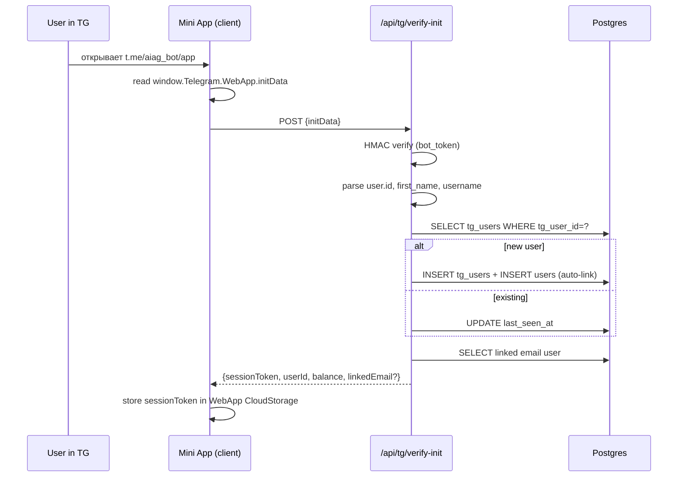
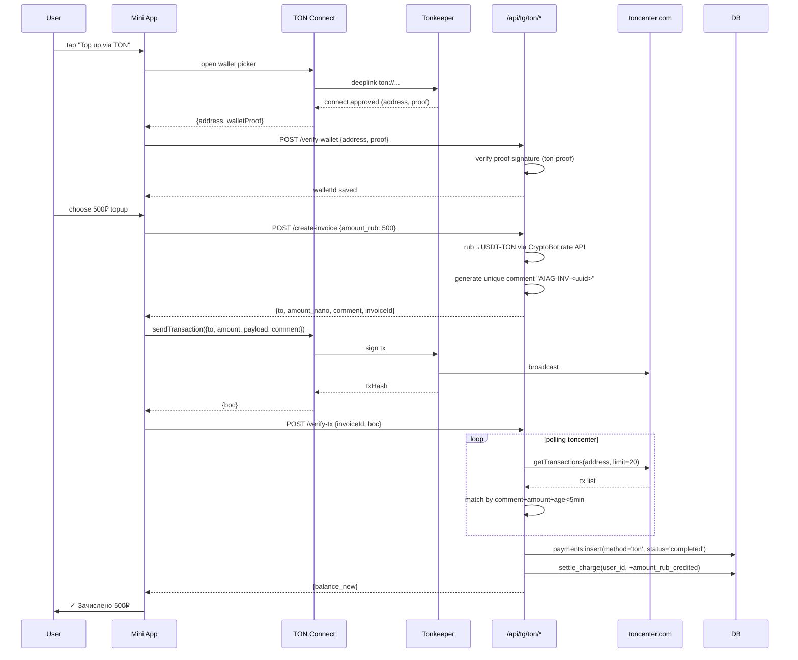
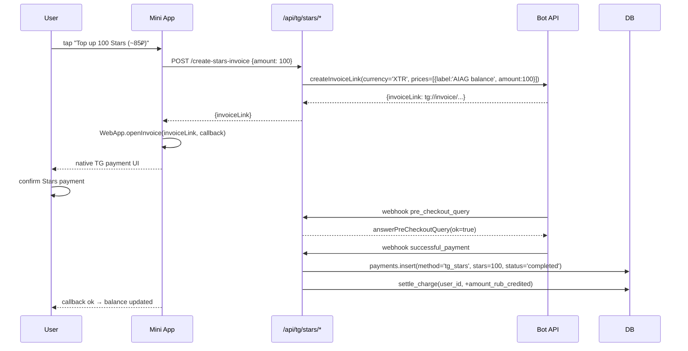

# Phase 15 — Telegram Mini App for AIAG (Design Spec)

**Status:** DESIGN ONLY (no code)
**Date:** 2026-05-08 (refined)
**Owner:** AIAG core
**Brain ref:** `Projects/AIAG/Knowledge/17-telegram-mini-app.md`
**Wireframes:** `Projects/AIAG/Wireframes/p15-tg-miniapp/*.html`

---

## Changes 2026-05-08 (refinement pass)

- **Theme** — отказ от `var(--tg-theme-*)`. Mini App визуально матчится с web-дизайном (`Design/home.html`) — dark `#0a0a0b` + amber `#f59e0b`, шрифты Inter / JetBrains Mono.
- **Scope cut** — Mini App = marketplace + agent runtime + balance + history + settings. Конкурсы / supply / reviews — **только web**.
- **Bottom nav** — 3 таба переименованы: **Агенты / Маркет / Профиль** (раньше Чат / Маркет / Профиль).
- **Manager Bot → Agent Runtime** — старый «Manager Chat» с intent-парсером заменяем на **полноценный agent runtime**: пользователь создаёт собственных агентов из 6 шаблонов + custom, общается с ними, агенты сами выбирают модели/инструменты через Hermes 4 405B function calling.
- **Wireframe `02-manager-chat.html` удалён**. Добавлены три новых: `02-agents-list.html`, `02b-agent-detail.html`, `02c-agent-create.html`.
- **TON Connect и x402** — explicitly Mini App-only. Web использует только Tinkoff / YooKassa / СБП. Подробнее — § 2.5.
- **Schema** — добавлены `agents` и `agent_runs` (см. § 7).

---

## 1. Goal & Scope

Запустить Telegram Mini App + companion-бота `@aiag_bot` как третью продуктовую surface (web → web-app → TG) для AIAG. Mini App встраивается в Telegram client и даёт:

1. **Agent Runtime** — пользователь создаёт собственных AI-агентов (Художник / Режиссёр / Композитор / Писатель / Аналитик / Свой) на базе **Hermes 4 405B** (NousResearch) с function calling. Агент сам выбирает модели и инструменты под задачу.
2. **Marketplace mini-UI** — упрощённая версия web-marketplace внутри TG (browse моделей, цены, try).
3. **Crypto-first payments**: TON Connect (Tonkeeper / MyTonWallet / OpenMask) + Telegram Stars (mini topup).
4. **Notifications**: balance low, agent run completed, new model.
5. **Settings**: linked wallets, дневной лимит на агента, web deep-link.

### Out of scope (Phase 15)

- **Конкурсы** — web only.
- **Supply / поставщики моделей** — web only.
- **Отзывы и рейтинги** — web only.
- Bot-to-Bot orchestration (Phase 4 в roadmap из brain/17).
- Inline-mode `@aiag_bot` в чужих чатах.

---

## 2. Architecture

### 2.1 Component diagram

```mermaid
flowchart TB
    subgraph TG[Telegram Client]
        WV[WebView with Mini App]
        BOT[@aiag_bot DM]
    end

    subgraph Edge[ai-aggregator.ru Edge]
        NGINX[nginx<br/>app.ai-aggregator.ru/tg]
    end

    subgraph App[apps/tg-miniapp]
        NEXT[Next.js 15 App Router<br/>+ @twa-dev/sdk<br/>+ @tonconnect/ui-react]
    end

    subgraph BFF[apps/tg-miniapp/api]
        VERIFY[/api/tg/verify-init<br/>HMAC-SHA256 verify/]
        TON[/api/tg/ton/verify-tx<br/>toncenter polling/]
        STARS[/api/tg/stars/invoice<br/>createInvoiceLink/]
        WEBHOOK[/api/tg/webhook<br/>Bot updates/]
        AGENT[/api/agents/*<br/>CRUD + run/]
    end

    subgraph Worker[apps/agent-worker]
        BULL[BullMQ queue<br/>agent-execute]
        HERMES[Hermes 4 405B<br/>via OpenRouter]
    end

    subgraph Core[Existing AIAG Core]
        GW[Gateway api.ai-aggregator.ru]
        DB[(Postgres + pgvector)]
    end

    WV --> NEXT
    BOT --> WEBHOOK
    NEXT --> VERIFY
    NEXT --> TON
    NEXT --> STARS
    NEXT --> AGENT
    AGENT --> BULL
    BULL --> HERMES
    HERMES --> GW
    GW --> DB
    AGENT --> DB
    VERIFY --> DB
    TON --> DB
```

### 2.2 Routing & deploy

| URL | Handler |
|-----|---------|
| `t.me/aiag_bot` | DM bot — entrypoint, `/start` opens Mini App via `setMenuButton` |
| `t.me/aiag_bot/app` | Mini App launcher → `https://app.ai-aggregator.ru/tg` |
| `https://app.ai-aggregator.ru/tg` | Next.js SSR root, all client-side after init |
| `https://app.ai-aggregator.ru/tg/api/...` | BFF endpoints (HMAC-verified) |
| `https://api.ai-aggregator.ru/v1/*` | Existing AIAG Gateway (unchanged) |

**Monorepo placement:** `apps/tg-miniapp/` (Next.js 15, app router). Shares `packages/db`, `packages/billing`, `packages/gateway-client`, `packages/design-system` с web app. Новый `apps/agent-worker/` — BullMQ worker для исполнения агентов.

### 2.3 SDKs

- `@twa-dev/sdk` — typed wrapper around `window.Telegram.WebApp`.
- `@tonconnect/ui-react` — wallet connect UI.
- `@ton/ton`, `@ton/core` — для проверки транзакций.
- `grammy` — bot framework для webhook (на BFF side).
- `openai` SDK с `baseURL=openrouter.ai` для Hermes 4 function calling.

### 2.4 Design tokens

Mini App **не использует** Telegram theme variables. Палитра привязана к web-дизайну (`Design/home.html`):

```css
:root {
  /* Surfaces */
  --bg:        #0a0a0b;
  --bg-elev:   #111114;
  --bg-elev-2: #16161a;

  /* Text */
  --ink:       #f4f4f5;
  --ink-muted: #a1a1aa;
  --ink-dim:   #71717a;

  /* Accent */
  --accent:      #f59e0b;
  --accent-hot:  #fbbf24;
  --accent-soft: rgba(245, 158, 11, 0.12);

  /* Lines / state */
  --line:    rgba(255, 255, 255, 0.08);
  --success: #10b981;
  --danger:  #ef4444;

  /* Type */
  --sans: 'Inter', -apple-system, BlinkMacSystemFont, 'Segoe UI', Roboto, sans-serif;
  --mono: 'JetBrains Mono', ui-monospace, SFMono-Regular, Menlo, Consolas, monospace;
}
```

TG-специфичные элементы (status bar 44px, home indicator 34px, sticky bottom nav) сохраняем — но в dark+amber исполнении.

### 2.5 Where x402 / TON live (mini-app vs web)

| Surface | Allowed payment | Notes |
|---------|-----------------|-------|
| **Web (`ai-aggregator.ru`)** | Tinkoff card / YooKassa / СБП. **Никакого** TON и x402 в UI | Юр. чистая площадка для физлиц-резидентов РФ |
| **Mini App (TG)** | TON Connect (primary) + Telegram Stars (mini) | Crypto-first audience, регулируется отдельной офертой |
| **Gateway (`api.ai-aggregator.ru`)** | `Authorization: Bearer aiag_*` для web-клиентов; `PAYMENT-SIGNATURE` (x402) для **внешних AI-агентов** | Web users → API key. External agents (Claude tool, GPT-tools, LangChain) → x402 |
| **Mini-app agent runtime** | Внутренние tool-calls идут от user balance. Опционально агент может оплачивать **внешние** ресурсы через x402 (если включен tool `x402_pay`) | Mini-app — единственный пользовательский surface, где x402 виден end-user (опционально) |

Итого: **x402 — это протокол поверхности агентного слоя** (наш agent runtime + внешние агенты, которые сами решили платить через x402). Web UI о нём ничего не знает.

---

## 3. Auth Flow (initData HMAC verify + linkage)

### 3.1 Theory

Telegram передаёт `initData` строкой query-params в `window.Telegram.WebApp.initData`:

```
query_id=AAH...
&user=%7B%22id%22%3A12345%2C%22first_name%22%3A%22Bob%22%2C%22username%22%3A%22b0brov%22%7D
&auth_date=1746700000
&hash=abc...
```

Сервер проверяет HMAC-SHA256:

```
secret_key = HMAC_SHA256("WebAppData", BOT_TOKEN)
data_check_string = sorted(params).join("\n")  // exclude hash
expected_hash = HMAC_SHA256(secret_key, data_check_string).hex()
assert expected_hash == params.hash
assert now - auth_date < 24h
```

### 3.2 Sequence



### 3.3 Linkage (TG ↔ email user)

Auto-link strategies (in order):

1. **Pre-link via web**: на web `/settings/integrations` юзер видит «Привязать Telegram» — генерим one-time code, юзер пишет `/link CODE` в `@aiag_bot` → backend связывает `users.id` ↔ `tg_user_id`.
2. **First-touch via TG**: если юзер впервые приходит из TG — создаём новый `users` row с `email = NULL`, `tg_user_id = ?`. Позже сможет добавить email.
3. **Email match**: если юзер указал email в Mini App settings и тот совпадает с существующим — отправляем confirm-link.

`tg_user_id` хранится unique not null в `tg_users.tg_user_id`, nullable в `users.tg_user_id` (для legacy email-only).

### 3.4 Session token

Подписанный JWT (`HS256`, 24h TTL), payload:
```json
{ "uid": "uuid", "tg": 12345, "iat": ..., "exp": ... }
```
Хранится в `WebApp.CloudStorage` (Telegram-side) — переживает закрытие mini app, но не утечёт за пределы устройства.

---

## 4. Payment Flows

### 4.1 TON Connect (primary)

#### Setup
- `tonconnect-manifest.json` на `https://app.ai-aggregator.ru/.well-known/tonconnect-manifest.json`:
  ```json
  {
    "url": "https://app.ai-aggregator.ru",
    "name": "AIAG",
    "iconUrl": "https://ai-aggregator.ru/icon-512.png",
    "termsOfUseUrl": "https://ai-aggregator.ru/terms",
    "privacyPolicyUrl": "https://ai-aggregator.ru/privacy"
  }
  ```

#### Flow



#### Edge cases
- Wallet rejected → `txStatus=cancelled`, no record.
- Network timeout → keep polling 10 min, then mark `pending_review`, surface UI «Проверка может занять до 10 минут».
- Wrong amount sent → backend matches by comment-uuid; mismatch → `pending_review` + Telegram message to user.
- Test net check: `network: '-3'` → reject in prod backend.

### 4.2 Telegram Stars (secondary, mini topup)

Для casual users без crypto. Лимит: до 5000 Stars (~65 USD) per topup.



Stars→₽ rate: фиксируем daily snapshot. Telegram fee 30% — учитывается в наценке.

### 4.3 Reuse of `settle_charge`

Существующая `packages/billing` функция `settle_charge(user_id, delta_rub, source, source_id)` вызывается одинаково для всех способов. Новые `source` enum values: `'ton'`, `'tg_stars'`. `source_id` = `payments.id`.

В Mini App **отключены** Tinkoff/YooKassa — fallback на web checkout если юзер хочет картой.

---

## 5. Agent Runtime Architecture (replaces «Manager Bot Intent Parser»)

### 5.1 Concept

Вместо single-shot intent-parser'а пользователь создаёт собственных **агентов** — каждый с системным промптом, whitelisted-моделями и набором инструментов. Агент работает на **Hermes 4 405B** (NousResearch) и сам решает, какие tool-calls делать.

### 5.2 Runtime model

```
Agent runtime: Hermes 4 405B (NousResearch) via OpenRouter
  - Function-calling native (tool use built-in)
  - 405B params, ~$3/M input + $5/M output
  - Markup 1.10 → AIAG list price ~3.30 / 5.50 ₽-эквивалент per M
  - Russian language: hybrid (English-trained, Russian fluent)

Stateless per-message, persistent conversation history:
  - Каждое user message → spawn `agent-execute` BullMQ job
  - Worker loads: agent.system_prompt + last 20 messages + current user msg
  - Calls Hermes via gateway с tools[] schema (resolved from agent.allowed_tools)
  - Tool-calls dispatched: image → /v1/images, video → /v1/video,
    search → SerpAPI/Tavily, x402 → micropayment broker
  - Каждый tool-call settle'ит charge с agent.owner_user_id баланса
  - Final response → user's TG chat

Scaling:
  - Horizontal: multiple worker replicas pull from `agent-execute` queue
  - Per-agent rate-limit: max 5 concurrent runs per agent (избегаем runaway loops)
  - Per-user budget: agent.daily_budget_rub cap (default 1000₽, configurable)
  - Hard timeout: 5 min per agent_run

Memory tiers:
  - "stateless"  — без истории, single-shot (cheapest)
  - "light"      — last 20 messages from agent_runs (default)
  - "persist"    — vector embeddings via PostgreSQL pgvector (optional, +cost)
```

### 5.3 Six prebuilt templates

| Template | Slug | Default tools | Default models |
|----------|------|---------------|----------------|
| 🎨 Художник | `artist` | `image_gen` | flux-pro, midjourney-v7, recraft-v3 |
| 🎬 Режиссёр | `director` | `video_gen`, `image_gen` (для кадров) | kling-3.0, sora-2, veo-3 |
| 🎵 Композитор | `composer` | `audio_gen` | suno-v4 |
| ✍️ Писатель | `writer` | `web_search`, `memory` | hermes-4 (own runtime) |
| 🔍 Аналитик | `analyst` | `web_search`, `code_interpreter` | hermes-4, gpt-4o |
| 🤖 Свой | `custom` | user-selected | user-selected |

Шаблон превращается в row в `agents` при первом инстанцировании — далее юзер может править prompt/models/tools.

### 5.4 Tool schema given to Hermes

```json
[
  {
    "type": "function",
    "function": {
      "name": "image_gen",
      "description": "Generate an image. Routes to flux-pro / midjourney / recraft based on style.",
      "parameters": {
        "type": "object",
        "properties": {
          "prompt": {"type": "string"},
          "aspect_ratio": {"type": "string", "enum": ["1:1","16:9","9:16","4:3"]},
          "style_hint": {"type": "string"}
        },
        "required": ["prompt"]
      }
    }
  },
  /* video_gen, audio_gen, web_search, code_interpreter, x402_pay, memory_recall */
]
```

### 5.5 Cost & budget enforcement

```
Pre-tool-call hook:
  estimated_cost = pricing.estimate(tool, params)
  IF user.balance < estimated_cost:
      return tool_result = { error: "insufficient_balance",
                             topup_link: "..." }
      → agent читает error, отвечает юзеру предложением пополнить
  IF agent.spent_today + estimated_cost > agent.daily_budget_rub:
      return tool_result = { error: "daily_budget_exceeded" }
```

Daily reset через cron (00:00 MSK) → `UPDATE agents SET spent_today=0`.

### 5.6 Async results in TG

Видео/audio jobs длятся минутами. Worker:
1. Запускает tool-call → BullMQ ставит в очередь.
2. Юзер видит «⏳ Готовлю видео…» bubble в Mini App.
3. По готовности — bot шлёт файл в DM `@aiag_bot` (sendVideo/sendDocument), Mini App показывает результат в `02b-agent-detail.html`.
4. Caption: `✓ Готово • -32₽ • Баланс: 446₽`.

---

## 6. UI Structure — screens (+ overlays)

| # | Screen | File | Purpose |
|---|---|---|---|
| 1 | Onboarding | `01-onboarding.html` | Welcome, terms, agent-first pitch |
| 2 | Agents list | `02-agents-list.html` | Хом таба «Агенты»: шаблоны + мои активные |
| 2b | Agent detail | `02b-agent-detail.html` | Conversation с агентом + tool-call display |
| 2c | Agent create | `02c-agent-create.html` | Multi-step мастер создания агента |
| 3 | Marketplace | `03-marketplace.html` | Browse моделей grid (без конкурсов) |
| 4 | Model Detail | `04-model-detail.html` | Hero + цена + Try button |
| 5 | Balance / Topup | `05-balance-topup.html` | Баланс + TON / Stars |
| 6 | TON Connect modal | `06-ton-connect.html` | Wallet picker overlay |
| 7 | Payment Confirm | `07-payment-confirm.html` | Pre-sign overview |
| 8 | History | `08-history.html` | Запуски агентов + платежи |
| 9 | Settings | `09-settings.html` | Wallets, дневной лимит, switch-to-web |

**Bottom nav (3 tabs):** **Агенты / Маркет / Профиль**.
- «Профиль» содержит History, Settings, Balance.

Theme — см. §2.4 (никаких `var(--tg-theme-*)`).

---

## 7. Schema Additions

```sql
-- TG identity (existing in original spec)
CREATE TABLE tg_users (
  tg_user_id BIGINT PRIMARY KEY,
  user_id UUID REFERENCES users(id) ON DELETE SET NULL,
  first_name VARCHAR(64),
  last_name VARCHAR(64),
  username VARCHAR(64),
  language_code VARCHAR(8),
  is_premium BOOLEAN DEFAULT false,
  created_at TIMESTAMPTZ NOT NULL DEFAULT now(),
  last_seen_at TIMESTAMPTZ NOT NULL DEFAULT now()
);
CREATE INDEX idx_tg_users_user_id ON tg_users(user_id);

CREATE TABLE ton_wallets (
  id UUID PRIMARY KEY DEFAULT gen_random_uuid(),
  user_id UUID NOT NULL REFERENCES users(id) ON DELETE CASCADE,
  ton_address VARCHAR(96) NOT NULL,
  network VARCHAR(16) NOT NULL DEFAULT 'mainnet',
  proof_payload TEXT,
  verified_at TIMESTAMPTZ,
  last_used_at TIMESTAMPTZ,
  created_at TIMESTAMPTZ NOT NULL DEFAULT now(),
  UNIQUE(user_id, ton_address, network)
);

ALTER TABLE users ADD COLUMN tg_user_id BIGINT UNIQUE;
ALTER TABLE payments ALTER COLUMN method TYPE VARCHAR(16);
ALTER TABLE payments ADD COLUMN tg_stars_amount INTEGER;
ALTER TABLE payments ADD COLUMN ton_tx_hash VARCHAR(128);
ALTER TABLE payments ADD COLUMN ton_invoice_uuid UUID;
CREATE UNIQUE INDEX idx_payments_ton_invoice ON payments(ton_invoice_uuid)
    WHERE ton_invoice_uuid IS NOT NULL;

-- ── NEW: agents ───────────────────────────────────────────
CREATE TABLE agents (
  id UUID PRIMARY KEY DEFAULT gen_random_uuid(),
  owner_user_id UUID NOT NULL REFERENCES users(id) ON DELETE CASCADE,
  name VARCHAR(100) NOT NULL,
  role_desc TEXT,
  template_kind VARCHAR(50),                  -- 'artist'|'director'|'composer'|'writer'|'analyst'|'custom'
  system_prompt TEXT NOT NULL,
  runtime_model VARCHAR(100) DEFAULT 'nousresearch/hermes-4-405b',
  allowed_models JSONB DEFAULT '[]'::jsonb,   -- model slugs whitelist
  allowed_tools JSONB DEFAULT '[]'::jsonb,    -- ['image_gen','video_gen','audio_gen','web_search','x402_pay','memory']
  memory_kind VARCHAR(20) DEFAULT 'light',    -- 'stateless'|'light'|'persist'
  daily_budget_rub NUMERIC(10,2) DEFAULT 1000,
  total_cost_rub NUMERIC(10,2) DEFAULT 0,
  spent_today_rub NUMERIC(10,2) DEFAULT 0,
  status VARCHAR(20) DEFAULT 'active',        -- 'active'|'paused'|'deleted'
  created_at TIMESTAMPTZ DEFAULT NOW(),
  last_run_at TIMESTAMPTZ
);

CREATE TABLE agent_runs (
  id UUID PRIMARY KEY DEFAULT gen_random_uuid(),
  agent_id UUID NOT NULL REFERENCES agents(id) ON DELETE CASCADE,
  user_message TEXT,
  steps JSONB,                                -- [{kind:'reasoning'|'tool_call'|'tool_result'|'final', content, model, cost}]
  final_response TEXT,
  total_cost_rub NUMERIC(10,2) DEFAULT 0,
  status VARCHAR(20) DEFAULT 'queued',        -- 'queued'|'running'|'completed'|'failed'|'timeout'|'cancelled'
  started_at TIMESTAMPTZ,
  finished_at TIMESTAMPTZ,
  duration_ms INTEGER,
  error TEXT
);

CREATE INDEX idx_agents_owner ON agents(owner_user_id, status);
CREATE INDEX idx_agent_runs_agent ON agent_runs(agent_id, started_at DESC);
```

`tg_chat_history` — **не добавляем**. Вся беседа с агентом живёт в `agent_runs.steps` (jsonb stream).

---

## 8. Edge Cases

| Case | Handling |
|------|----------|
| User opens app outside Telegram (web URL leak) | `WebApp.initData` пустой → redirect на `https://ai-aggregator.ru` с UTM `?ref=tg-leak` |
| Old TG client (`WebApp.version < 6.1`) | Detect via `WebApp.isVersionAtLeast` → «Обнови Telegram», disable payments |
| `initData` expired (>24h) | Force re-open Mini App, show «Сессия устарела» |
| TON wallet not connected, user taps Pay TON | Open TON Connect modal first, queue payment intent |
| TON tx broadcast но не подтверждена (toncenter timeout 10 min) | Mark payment `pending_review`, send notification, ops can manually settle |
| User declines pre-checkout for Stars | Just close modal, no record |
| Agent runaway loop (>10 tool calls in run) | Hard cap = 12 tool calls, then `error='step_limit'` |
| Insufficient balance during agent run | Tool returns `{error: 'insufficient_balance'}`; agent отвечает с topup link |
| Daily budget exceeded | Same — `{error: 'daily_budget_exceeded'}`; status pill в UI меняется на «paused» до 00:00 MSK |
| Hermes 4 down (OpenRouter 5xx) | Retry с экспоненциальным backoff 3 попытки → `agent_runs.status='failed'`, error в UI |
| User blocked by Telegram | Webhook gives 403 — mark `tg_users.last_seen_at` stale, stop notifications |
| Mini App opens via deep-link with `start_param` | Parse (e.g. `ref=invite_xyz` или `agent=<uuid>`) → route accordingly |
| Mobile vs desktop TG client | Mobile: bottom nav fixed; desktop: same layout (375 / 480 / 720). `position:sticky` ок на iOS Safari ≥16 |
| Theme switch mid-session | Игнорируем `themeChanged` — у нас фиксированный dark/amber |

---

## 9. Compliance & Legal

### 9.1 TON wallet ≠ persona

TON address — псевдоним. Для compliance:
- Не идентифицируем юзера по wallet alone — всегда есть `tg_user_id` parent.
- ToS § «Crypto top-up»: «AIAG не оказывает услуг exchange. Зачисление ₽ — за товар (AI-кредиты), не за валюту».

### 9.2 KYC trigger

При суммарном пополнении >100 000 ₽/мес через TON — soft-limit + ops review.

### 9.3 152-ФЗ

`tg_users` хранит first_name, username — это персональные данные. Согласие на onboarding screen.

### 9.4 Telegram ToS

- Mini App не дублирует функции Telegram (мы AI generation, не messaging clone).
- Stars → virtual goods (AI кредиты) — допустимо.

### 9.5 РФ legal note

T-Bank/YooKassa — для «белой» оплаты картой (web only). TON Connect — серая зона. Готов план: при первом запросе ЦБ/Роскомнадзор — отключаем TON, переключаем на Stars + web checkout.

---

## 10. Risks

| Risk | Prob | Impact | Mitigation |
|---|---|---|---|
| Telegram client diff: mobile vs desktop layout breaks | M | M | Test matrix: iOS / Android / Desktop / Web TG. `WebApp.platform` для conditional UX |
| WebView limitations: no `localStorage` persistence on iOS | L | M | `WebApp.CloudStorage` (server-backed), fallback `sessionStorage` |
| TON Connect protocol breaks | L | H | Pin `@tonconnect/ui-react`, monitor changelog, e2e smoke на каждом deploy |
| toncenter rate-limit / outage | M | H | Two providers: `toncenter.com` + `tonapi.io` failover |
| TON/RUB rate volatility (~5-10% daily) | H | L | Lock rate at invoice creation, valid 5 min |
| Telegram Stars 30% fee | M | M | Markup +35% to Stars topups (visible: «комиссия Telegram включена») |
| Hermes 4 405B latency (cold start) | M | M | Warm pool через ping каждые 60s; fallback на claude-sonnet если >30s |
| Hermes 4 hallucinated tool args | M | H | JSON Schema strict validation; retry once with error feedback; fail run on second invalid |
| Agent runaway cost | H | H | `daily_budget_rub` hard cap + max 12 tool calls/run + 5 min timeout |
| Spam attacks on agent runtime | H | M | 5 concurrent runs/agent, 30 messages/min/user, captcha after 50/hour |
| Wallet user farms | M | L | Soft warning ops review on >2 accounts/wallet |
| Mini App rejected by BotFather review | L | H | Strict design guidelines, no external auth, no scam-shaped UI |

---

## 11. Agent conversation examples

### Example 1 — Художник (image)

```
User: нарисуй кота-самурая в стиле акварель, вертикально

Agent (Художник):
  💭 Подбираю модель: для акварели и стилизации — flux-pro
  🎨 image_gen({prompt: "watercolor cat samurai, traditional Japanese painting…",
                aspect_ratio: "9:16"})
  → [image] (~6₽)

  Готово! Ещё в этом стиле или другую сцену?

User: ещё, но с лисой

Agent: 🎨 image_gen({…}) → [image]
```

### Example 2 — Режиссёр (multi-step)

```
User: видео заката, kling 6 секунд

Agent (Режиссёр):
  💭 Генерю reference-кадр → потом video на его основе
  🎨 image_gen({prompt: "cinematic ocean sunset, golden hour…", aspect_ratio: "9:16"})
  → [image] (~4₽)
  🎬 video_gen({prompt:"...", model:"kling-3.0", duration:6, image_ref: "..."})
  → [video] (~32₽)

  ✓ Готово • -36₽ • Баланс 462₽
```

### Example 3 — Аналитик (web search + code)

```
User: найди топ-5 нейросетей для видео в 2026 и сделай таблицу

Agent (Аналитик):
  🔍 web_search("top video AI models 2026")
  → 12 результатов
  💭 Анализирую…
  💻 code_interpreter("сравнить по latency / quality / price → markdown table")
  → table

  Вот таблица. Хочешь — сохраню в memory или экспорт CSV?
```

---

## 12. Implementation Plan (informational)

1. **15.1 (this phase)** — spec + wireframes ✓
2. **16.1** — `apps/tg-miniapp/` scaffold + BotFather + deploy
3. **16.2** — `verify-init` + JWT session + onboarding screen
4. **16.3** — Agents UI (list / detail / create) + agent CRUD API
5. **16.4** — `apps/agent-worker` BullMQ + Hermes 4 integration + tool dispatch
6. **16.5** — TON Connect + payment verification
7. **16.6** — TG Stars
8. **16.7** — Marketplace + model detail
9. **16.8** — Notifications bot + balance-low alerts
10. **17.x** — Memory persist (pgvector), agent sharing, sub-agent orchestration

---

## 13. Open questions for next /gsd:discuss-phase

1. Hermes 4 405B vs Hermes 4 70B для runtime — bench по latency и качеству tool-calling.
2. Markup на Stars topups — фиксированный +35% или sliding scale?
3. Кто платит за `web_search` — fixed-fee к юзеру или поглощаем?
4. Memory persist (pgvector) — включаем в MVP или Phase 17?
5. TON Connect: только mainnet или offer testnet для dev/staging?

---

## 14. Acceptance Checklist (design phase)

- [x] Architecture diagram (mermaid)
- [x] Auth flow с HMAC verify
- [x] Payment flows (TON + Stars + reuse settle_charge)
- [x] Agent runtime architecture (Hermes 4 + tools + budget)
- [x] 11 wireframes (3 новых для agents, 8 обновлённых)
- [x] Edge cases enumerated
- [x] Compliance notes
- [x] Risks table
- [x] Agent conversation examples (3)
- [x] Schema additions (DDL) — agents + agent_runs + TG/TON tables
- [x] Design tokens locked to web design (no TG theme vars)
- [x] x402/TON scope clarified (mini-app only)
- [x] No code changes (только docs + HTML wireframes)
